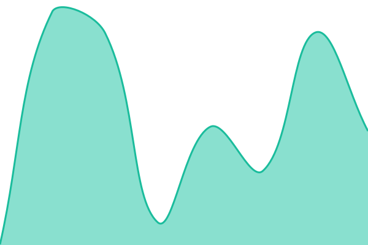
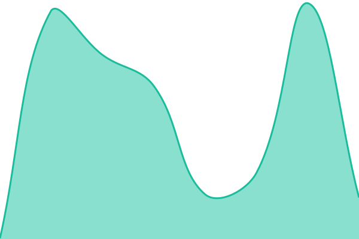
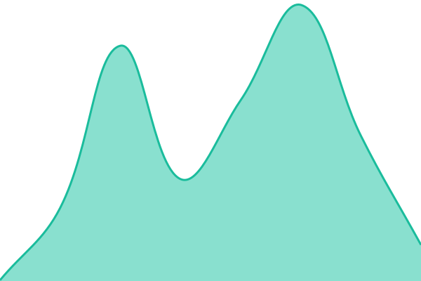

# [📈 Live Status](https://CorMetrix-Official.github.io/cormetrix-health-status): <!--live status--> **🟩 All systems operational**

This repository contains the open-source uptime monitor and status page for [CorMetrix-Official](https://CorMetrix-Official.github.io/cormetrix-health-status), powered by [Upptime](https://github.com/upptime/upptime).

With [Upptime](https://upptime.js.org), you can get your own unlimited and free uptime monitor and status page, powered entirely by a GitHub repository. We use [Issues](https://github.com/CorMetrix-Official/cormetrix-health-status/issues) as incident reports, [Actions](https://github.com/CorMetrix-Official/cormetrix-health-status/actions) as uptime monitors, and [Pages](https://CorMetrix-Official.github.io/cormetrix-health-status) for the status page.

<!--start: status pages-->
<!-- This summary is generated by Upptime (https://github.com/upptime/upptime) -->
<!-- Do not edit this manually, your changes will be overwritten -->
<!-- prettier-ignore -->
| URL | Status | History | Response Time | Uptime |
| --- | ------ | ------- | ------------- | ------ |
|  VerixAi Frontend Application | 🟩 Up | [verix-ai-frontend-application.yml](https://github.com/CorMetrix-Official/cormetrix-health-status/commits/HEAD/history/verix-ai-frontend-application.yml) | 

 199ms
     
 | 

<a href="https://CorMetrix-Official.github.io/cormetrix-health-status/history/verix-ai-frontend-application">100.00%</a>
    

|  VerixAi Login Server Endpoint | 🟩 Up | [verix-ai-login-server-endpoint.yml](https://github.com/CorMetrix-Official/cormetrix-health-status/commits/HEAD/history/verix-ai-login-server-endpoint.yml) | 

 200ms
     
 | 

<a href="https://CorMetrix-Official.github.io/cormetrix-health-status/history/verix-ai-login-server-endpoint">100.00%</a>
    

|  VerixAi Backend Endpoint | 🟩 Up | [verix-ai-backend-endpoint.yml](https://github.com/CorMetrix-Official/cormetrix-health-status/commits/HEAD/history/verix-ai-backend-endpoint.yml) | 

 184ms
     
 | 

<a href="https://CorMetrix-Official.github.io/cormetrix-health-status/history/verix-ai-backend-endpoint">100.00%</a>
    

|  VerixAi Chat Endpoint | 🟩 Up | [verix-ai-chat-endpoint.yml](https://github.com/CorMetrix-Official/cormetrix-health-status/commits/HEAD/history/verix-ai-chat-endpoint.yml) | 

 280ms
     
 | 

<a href="https://CorMetrix-Official.github.io/cormetrix-health-status/history/verix-ai-chat-endpoint">100.00%</a>
    

|  VerixAi ETL Endpoint | 🟩 Up | [verix-ai-etl-endpoint.yml](https://github.com/CorMetrix-Official/cormetrix-health-status/commits/HEAD/history/verix-ai-etl-endpoint.yml) | 

 179ms
     
 | 

<a href="https://CorMetrix-Official.github.io/cormetrix-health-status/history/verix-ai-etl-endpoint">100.00%</a>
    

<!--end: status pages-->

[**Visit our status website →**](https://CorMetrix-Official.github.io/cormetrix-health-status)

## 📄 License

- Powered by: [Upptime](https://github.com/upptime/upptime)
- Code: [MIT](./LICENSE) © [Anand Chowdhary](https://anandchowdhary.com), supported by [Pabio](https://pabio.com)
- Data in the `./history` directory: [Open Database License](https://opendatacommons.org/licenses/odbl/1-0/)
